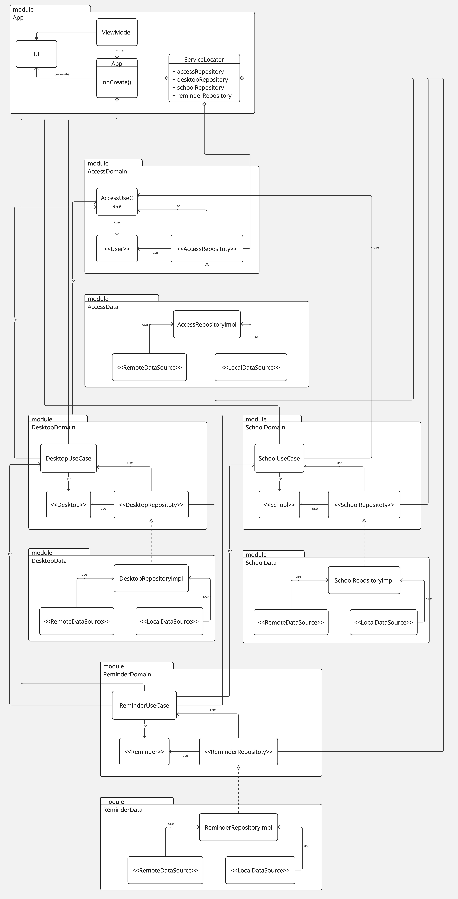

# IntelligentBackpackApp

## Architecture

## Description

The Intelligent Backpack is a project that aims to help user to organize their school life.
 The mobile application is used to scan the QR code of the backpack and connect it to the user account.
 Then the user can add school supplies to the account (books for now).
The teacher will be able to add a book to a lesson and the student will be able to see the books he needs for the next lesson of the day.
The student will also be notified when he has missed a school supply.

## Requisites

- Java 17
- Android Studio Giraffe | 2022
- Android SDK 29 (Android 10.0) or higher
- Android SDK Build-Tools 29.0.2 or higher
- Android Emulator or Android Device
